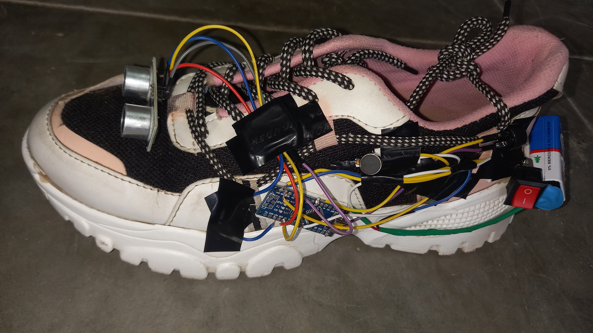

# Blind Assistance Shoe

## Introduction
The Blind Assistance Shoe is designed to assist visually impaired individuals by providing real-time navigation and obstacle detection.
The shoe integrates various technologies to offer a comprehensive solution for mobility and safety.

## Problem Statement
Visually impaired individuals face significant challenges while navigating through various environments.
The goal of this project is to create a shoe that provides navigation assistance and obstacle detection to enhance mobility and safety.

## Solution
The Blind Assistance Shoe incorporates:
- **Arduino Uno**: The main controller for processing sensor data and controlling the system.
- **GPS Module**: For providing location tracking and navigation assistance.
- **GSM Module**: For sending location updates and emergency alerts.
- **Ultrasonic Sensors**: For detecting obstacles and providing real-time feedback to the user.
- **Vibration Sensor**: This provides the haptic feedback to the user.

## Components Used
- Arduino Uno
- GPS Module (Neo-6M)
- GSM Module (SIM900)
- Ultrasonic Sensors (HC-SR04)
- Power Supply (Battery Pack)
- Vibration Motor
- Miscellaneous electronic components (resistors, capacitors, etc.)

## Circuit Diagram
The circuit diagram for the Blind Assistance Shoe is shown below. 


## Code
The source code for the project is given in the below:

```cpp
#include <SoftwareSerial.h>
#include <TinyGPS++.h>

// Define pins for the ultrasonic sensor
#define pingPin 2        // Trig pin of HC-SR04
#define echoPin 3

// Define pins for the GSM module
#define GSM_RX 7
#define GSM_TX 8

// Define pins for the GPS module
#define GPS_RX 4
#define GPS_TX 5

// Initialize SoftwareSerial for GSM and GPS
SoftwareSerial gsmSerial(GSM_RX, GSM_TX);
SoftwareSerial gpsSerial(GPS_RX, GPS_TX);

// Create TinyGPS++ object
TinyGPSPlus gps;

void setup() {
    Serial.begin(9600); // Starting Serial Terminal

    // Set up pins for the ultrasonic sensor
    pinMode(pingPin, OUTPUT); 
    pinMode(echoPin, INPUT);
    
    // Set up pins for buzzer and vibration motor
    pinMode(12, OUTPUT);   // Pin 12 is used as GND pin for buzzer
    pinMode(A3, OUTPUT);   // Pin A3 provides the output to the buzzer
    pinMode(5, OUTPUT);    // Pin 5 is used for the vibration motor

    // Initialize GSM and GPS serial connections
    gsmSerial.begin(9600);
    gpsSerial.begin(9600);
}

void loop() {
    long duration, cm;
    digitalWrite(12, LOW);   // Buzzer GND is always low

    // Handle Ultrasonic Sensor
    digitalWrite(pingPin, LOW);
    delayMicroseconds(2);    
    digitalWrite(pingPin, HIGH);
    delayMicroseconds(10);
    digitalWrite(pingPin, LOW);

    duration = pulseIn(echoPin, HIGH);
    cm = microsecondsToCentimeters(duration);

    // Handle Buzzer and Vibration Motor based on distance
    if (cm < 30 && cm > 20) {
        analogWrite(A3, 255); 
        digitalWrite(5, HIGH);
        delay(1000); 
        analogWrite(A3, 0); 
        digitalWrite(5, LOW); 
        delay(1000); 
    } else if (cm < 20 && cm > 10) {
        analogWrite(A3, 255); 
        digitalWrite(5, HIGH);
        delay(500); 
        analogWrite(A3, 0); 
        digitalWrite(5, LOW); 
        delay(500); 
    } else if (cm < 10 && cm > 0) {
        analogWrite(A3, 255); 
        digitalWrite(5, HIGH);
        delay(100); 
        analogWrite(A3, 0);
        digitalWrite(5, LOW); 
        delay(100); 
    } else {
        analogWrite(A3, 0); 
        digitalWrite(5, LOW); 
    }

    // Handle GPS Module
    while (gpsSerial.available() > 0) {
        gps.encode(gpsSerial.read());

        if (gps.location.isUpdated()) {
            float latitude = gps.location.lat();
            float longitude = gps.location.lng();
            Serial.print("Latitude= "); Serial.print(latitude, 6);
            Serial.print(" Longitude= "); Serial.println(longitude, 6);

            // Send location via GSM
            String message = "Location: Latitude=" + String(latitude, 6) + " Longitude=" + String(longitude, 6);
            gsmSerial.println("AT+CMGF=1"); // Set SMS to text mode
            delay(1000);
            gsmSerial.println("AT+CMGS=\"+1234567890\""); // Replace with your phone number
            delay(1000);
            gsmSerial.println(message);
            delay(1000);
            gsmSerial.println((char)26); // Send SMS
            delay(1000);
        }
    }
}

// Function to return distance in cm from microseconds
long microsecondsToCentimeters(long microseconds) {
    return microseconds / 29 / 2;
}
```


## Demo Photo
A demo photo showcasing the assitance is shown below.



## Conclusion
The Blind Assistance Shoe successfully integrates multiple technologies to assist visually impaired users. 
The project was completed on time, with the final product presented at a hackathon.

## License
This project is licensed under the MIT License. 

## Acknowledgements
- Special thanks to the team members for their hard work and dedication.
- Thank you to the mentors and advisors for their guidance throughout the project.
